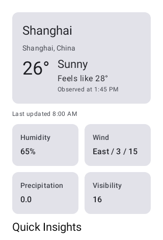
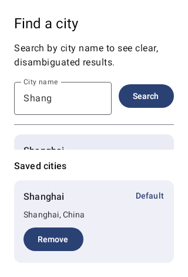
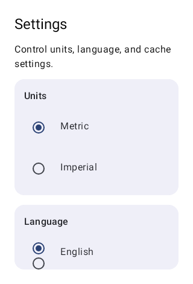
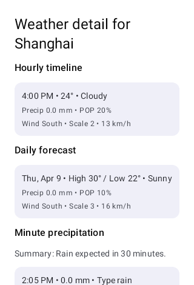

# WeatherForecast

基于 Kotlin + Jetpack Compose 开发的 Android 天气应用，后端接入和风天气（QWeather）API。

## 项目能力概览
- 多页面天气应用：`首页`、`城市搜索`、`设置`、`天气详情`。
- 基于 `NavigationSuiteScaffold` 的自适应导航，适配手机、折叠屏、平板。
- 支持应用内中英切换（English / 简体中文），并在界面层即时生效。
- 全局使用 Snackbar 反馈操作结果与网络/缓存状态。
- 使用 Room + DataStore 构建缓存链路，提升弱网下可用性。

英文文档见 [README.md](README.md)。

## 截图展示
### 首页


### 城市搜索


### 设置


### 天气详情


## 核心功能
- **首页**
  - 当前天气卡片（温度、天气、体感、湿度、风况、降水、能见度）。
  - 未来 24 小时与未来 7 天天气。
  - 快速摘要（预警摘要 + 空气质量摘要）。
  - 跳转城市详情天气。
- **城市搜索**
  - 接入和风天气城市检索与热门城市。
  - 保存城市、设置默认城市、删除城市。
- **设置**
  - 单位制切换（公制 / 英制）。
  - 语言切换（英语 / 简体中文），应用内无缝生效。
  - 清理天气缓存。
- **天气详情**
  - 逐小时时间线、逐日预报。
  - 分钟级降水。
  - 日出日落。
  - 生活指数。
  - 天气预警。
  - 空气质量与污染物拆解。

## 后端与 API 集成
- **鉴权方式**：OkHttp 拦截器注入请求头 `X-QW-Api-Key`。
- **基础地址处理**：由本地运行时配置解析并自动标准化。
- **序列化**：`kotlinx.serialization`（开启 `ignoreUnknownKeys`）。
- **主要接口分组**
  - 地理接口：
    - `geo/v2/city/lookup`
    - `geo/v2/city/top`
  - 天气接口：
    - `v7/weather/now`
    - `v7/weather/24h`
    - `v7/weather/7d`
    - `v7/minutely/5m`
    - `v7/astronomy/sun`
    - `v7/indices/1d`
    - `weatheralert/v1/current/{lat}/{lon}`
    - `airquality/v1/current/{lat}/{lon}`

## 架构与数据流
- 采用现代 Android Clean Architecture：`feature -> domain -> data`。
- Domain 层以仓库接口抽象业务依赖（如 `WeatherRepository`、`CityRepository`、`SettingsRepository`）。
- Data 层拆分实现：
  - `QWeatherCityRepository`：城市检索/保存/默认城市。
  - `QWeatherForecastRepository`：当前/逐小时/逐日天气 + Room 缓存。
  - `QWeatherSecondaryRepository`：预警、AQI、分钟降水、日出日落、生活指数。
  - `QWeatherWeatherRepository`：组合上述天气仓库能力。
- `WeatherRequestPolicyStore` 提供 TTL 新鲜度判断与失败退避（backoff）策略，降低连续失败时的无效自动重试。

## 快速开始
1. 准备本地私有的 QWeather 运行配置（不要将敏感信息提交到版本库）。
2. 编译与安装：
   ```bash
   ./gradlew :app:assembleDebug
   ./gradlew :app:installDebug
   ```
3. 运行测试：
   ```bash
   ./gradlew :app:testDebugUnitTest
   ./gradlew :app:connectedDebugAndroidTest
   ```

## 技术栈
- Kotlin、Coroutines、Flow
- Jetpack Compose、Material 3、Material 3 Adaptive
- Navigation Compose
- Hilt 依赖注入
- Retrofit、OkHttp、kotlinx.serialization
- Room、DataStore
- JUnit、MockK、Truth、Turbine、Compose UI Test、Robolectric、Roborazzi
